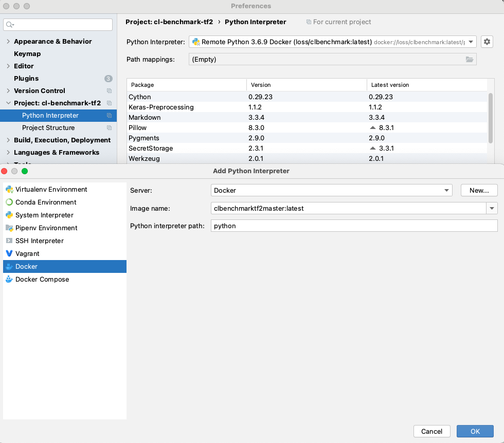
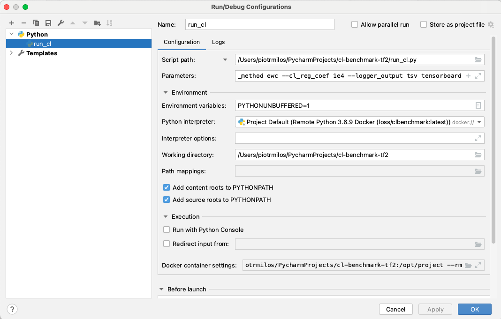

### Get docker image

Build the image from ``assests/Dockefile``. Note you need to put your mujoco license in ``mjkey.txt``.

- ``cd assets``
- ``docker build . -t clbenchmarktf2master``


### Setup Pycharm
- Setup a new project and pull ```https://github.com/zajaczajac/cl-benchmark-tf2```
- Setup a docker interpreter: 
  


- Setup example run (use parameters ``--seed 0 --steps_per_task 2e3 --tasks DOUBLE_PMO1 --cl_method ewc --cl_reg_coef 1e4 --logger_output tsv tensorboard`` to get the same as ``examples/cl_example.sh``):



- enjoy your training! You can find logs in ``logs``
